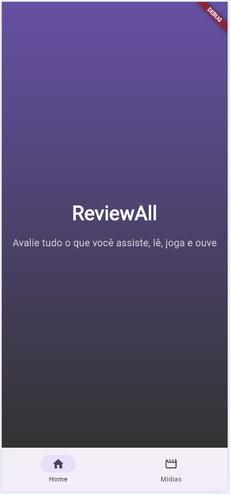
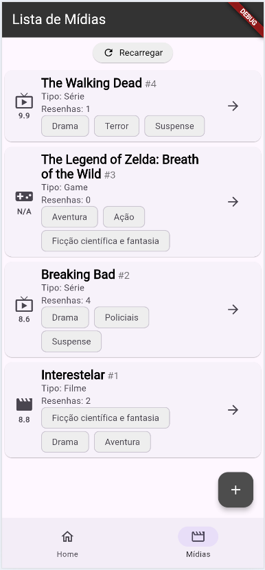
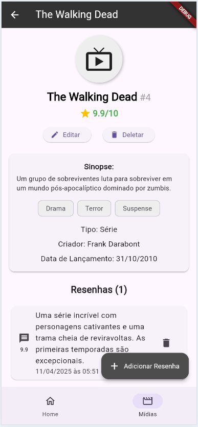
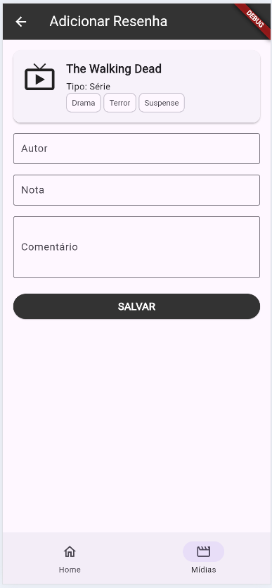
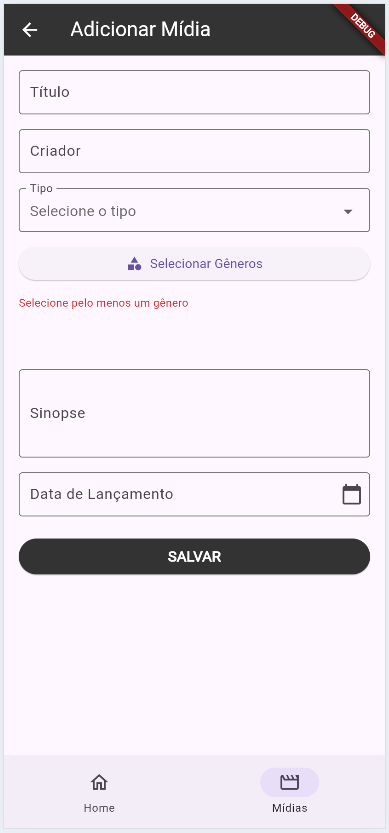

# mobile_studegate

Aluno: *ALFREDO DE SOUZA AGUIAR NETO* e *ANA BEATRIZ MARQUES MOREIRA*

## Usuários para Teste

- **maria@gmail.com**  
  Senha: **maria**

- **pedro@gmail.com**  
  Senha: **pedro**
  

## Funcionalidades do Sistema

O aplicativo acadêmico desenvolvido para a disciplina de PROGRAMAÇÃO PARA DISPOSIVOS MÓVEIS I oferece diversas funcionalidades voltadas à gestão e acompanhamento da vida acadêmica dos alunos. A seguir, estão descritas as principais funcionalidades do sistema:

### 1. Login
Permite o acesso seguro ao sistema por meio de autenticação com e-mail e senha. Usuários cadastrados podem acessar suas informações acadêmicas.

### 2. Dashboard (Tela Inicial)
Após o login, o usuário é direcionado para a tela inicial, que apresenta seis cards de navegação para as principais funcionalidades do sistema:

- **Boletim (Semestre Atual):** Visualização do desempenho nas disciplinas do semestre, incluindo nome da disciplina, nota, frequência e status.
- **Grade Curricular:** Exibição da grade curricular do curso, com seleção de curso via dropdown e listagem das disciplinas por período.
- **Rematrícula Online:** Possibilita a seleção de disciplinas para rematrícula, com botão de confirmação.
- **Situação Acadêmica:** Mostra o status acadêmico do aluno, como situação de documentos, pendências e matrícula ativa.
- **Análise Curricular:** Permite acompanhar o progresso do curso, mostrando uma barra de porcentagem e listando disciplinas concluídas e pendentes.

### 3. Boletim
Exibe a lista de disciplinas do semestre atual, apresentando informações como nome, nota, frequência e status de aprovação.

### 4. Grade Curricular
Permite ao aluno visualizar a grade curricular completa, selecionar o curso (quando aplicável) e acessar a relação de disciplinas organizadas por período.

### 5. Rematrícula
Facilita o processo de rematrícula, onde o aluno pode selecionar as disciplinas desejadas e confirmar a matrícula em um único lugar.

### 6. Situação Acadêmica
Apresenta o estado atual do aluno em relação a documentos, pendências financeiras ou acadêmicas, e matrícula.

### 7. Análise Curricular
Mostra o avanço do aluno no curso por meio de uma barra de porcentagem e lista detalhada de disciplinas já concluídas e aquelas que ainda precisam ser cursadas.

---

Essas funcionalidades visam proporcionar uma experiência completa para o aluno no acompanhamento de sua trajetória acadêmica, tornando o gerenciamento de informações mais prático e acessível.

<!-- Aplicativo Flutter para gerenciar e avaliar diversos tipos de mídias, como filmes, séries, livros, jogos e muito mais. -->

<!-- **Você pode baixar o aplicativo para Android aqui:** [Download](https://drive.google.com/file/d/1wAxF1tJ6YBwpLQLSX4RY7r24QfOlge-K/view?usp=sharing)

## Sobre o Aplicativo

Este aplicativo foi desenvolvido como parte do curso de **PROGRAMACAO PARA DISPOSITIVOS MOVEIS I** na **UNIVERSIDADE ESTADUAL DO TOCANTINS** pelo aluno **ALFREDO DE SOUZA AGUIAR NETO**.
O aplicativo permite aos usuários:
- Adicionar, editar e excluir entradas de mídias.
- Adicionar resenhas para cada mídia, incluindo notas e comentários.
- Visualizar uma lista de mídias com detalhes como título, criador, tipo, gêneros, sinopse, data de lançamento e avaliação média, assim como uma lista de resenhas associadas a cada mídia.

## Integração com API

O aplicativo utiliza o [MockAPI](https://mockapi.io/projects/67e6f0a56530dbd31111f8e3) para criar uma API online para gerenciar mídias e resenhas. Os seguintes recursos e seus atributos são utilizados:

### Recurso de Mídia (`/media`)
- **id**: Identificador único da mídia (string).
- **createdAt**: Data e hora em que a mídia foi criada (formato ISO 8601).
- **title**: Título da mídia (string).
- **creator**: Criador da mídia (string).
- **type**: Tipo da mídia (ex.: "Filme", "Série", "Livro") (string).
- **genre**: Lista de gêneros associados à mídia (array de strings).
- **synopsis**: Breve descrição da mídia (string).
- **releaseDate**: Data de lançamento da mídia (formato ISO 8601).

### Recurso de Resenha (`/review`)
- **id**: Identificador único da resenha (string).
- **createdAt**: Data e hora em que a resenha foi criada (formato ISO 8601).
- **user**: Nome do usuário que escreveu a resenha (string).
- **rating**: Nota atribuída à mídia (double, máximo 10).
- **comment**: Comentário ou opinião sobre a mídia (string).
- **mediaId**: ID da mídia associada à resenha (string).

### Imagens de Tela

  
  

  
  

  

## Como Começar

Este projeto é um ponto de partida para um aplicativo Flutter.

Alguns recursos para começar se este for seu primeiro projeto Flutter:
- [Lab: Escreva seu primeiro aplicativo Flutter](https://docs.flutter.dev/get-started/codelab)
- [Cookbook: Exemplos úteis de Flutter](https://docs.flutter.dev/cookbook)

Para obter ajuda no desenvolvimento com Flutter, acesse a [documentação online](https://docs.flutter.dev/), que oferece tutoriais, exemplos, orientações sobre desenvolvimento móvel e uma referência completa da API. -->

<!-- Refatorar: 
lib/
├── components/    # Widgets reutilizáveis (botões, cards, list...)
├── models/        # Representações de dados (ex: UserModel, ProductModel)
├── screens/       # Telas do app (LoginScreen, HomeScreen...)
├── services/      # Lógica de acesso à API, SharedPreferences, etc
└── main.dart      # Ponto de entrada do app -->